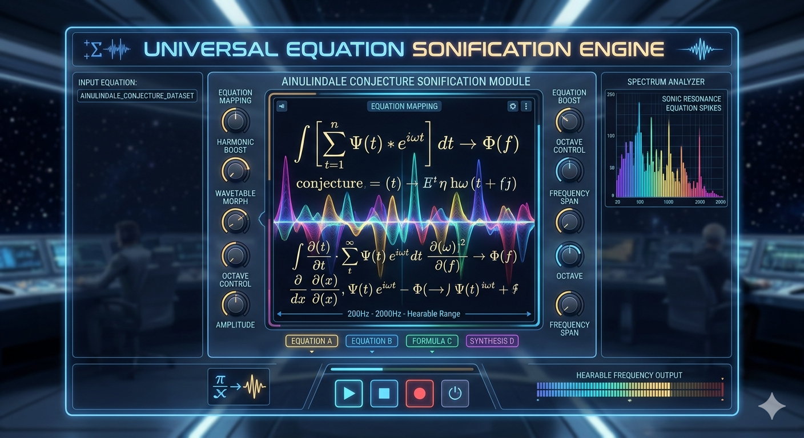

# UniversalSynth

<p align="center">
  
</p>

**Author:** Cody Michael Allison  
**Status:** Active development — sonification engine for the SMMIP framework  
**Satellite of:** [Ainulindalë](https://github.com/michaelrendier/Ainulindale) · [PtolemyHolcus](https://github.com/michaelrendier/PtolemyHolcus)

---

> *The universe is a standing wave. The Riemann zeros are its harmonics.*  
> *UniversalSynth makes the mathematics audible.*

---

## What This Is

UniversalSynth is the sonification engine for the Standard Model of Monad Information Propagation (SMMIP) framework. It converts mathematical structures — standing wave modes, spectral resonances, Riemann zeta zeros, Schumann cavity frequencies — directly into audio.

This is not algorithmic composition. The equations are not *inspiration* for the music. The equations **are** the music. The waveforms are derived, not designed.

---

## The Philosophy

The J_N anti-Möbius involution $J_N(z) = i/\bar{z}$ generates a four-cycle standing wave on the Riemann sphere $S^2$. Its fundamental mode is $Y_1^0(\theta) = \cos\theta$ — one node, one frequency, one equatorial line. The non-trivial zeros of the Riemann zeta function are the spectral resonances of this system.

Chladni (1787) discovered that sand migrates to the nodes of a vibrating plate — the geometry of a standing wave writes itself in physical media. UniversalSynth inverts this: it takes the geometry and produces the wave that would have caused it.

Every output of UniversalSynth is a direct acoustic realization of a mathematical object. The Schumann resonance at 7.83 Hz is not sampled — it is computed from the Earth-ionosphere cavity radius and the speed of light, then synthesized. The Riemann zeta harmonics are not approximated — they are the actual imaginary parts of the known zeros, rendered as partials in a standing wave spectrum.

The universe sang before anyone listened. This is the instrument built to hear it.

---

## Mathematical Sources

| Source | Domain | UniversalSynth Realization |
|---|---|---|
| **J_N period 2π** | Anti-Möbius geometry | Four-cycle oscillator; fundamental at l=1 |
| **Y_lm spherical harmonics** | S² mode spectrum | Harmonic series derived from l(l+1) eigenvalues |
| **Riemann zeta zeros** | Analytic number theory | Zero imaginary parts as partial frequencies |
| **Schumann resonances** | Earth-ionosphere cavity | f_n = (c/2πR)√(n(n+1)); f₁ = 7.83 Hz |
| **Chladni node geometry** | Acoustic physics | Node-line patterns → silence boundaries in synthesis |
| **Cayley-Dickson tower** | Algebra | ℝ→ℂ→ℍ→𝕆 doubling → octave/phase doubling in audio |
| **d\* spectral fixed point** | Berry-Keating domain | 0.24600 as spectral anchor frequency ratio |
| **Ω_ζσ Lambert W fixed point** | BK domain ceiling | 0.56714 as envelope ceiling / decay constant |

---

## Architecture

```
UniversalSynth/
├── README.md                        — This document
│
├── engines/
│   ├── standing_wave.py             — J_N four-cycle oscillator; Y_lm mode synthesis
│   ├── zeta_harmonics.py            — Riemann zero partials → audio spectrum
│   ├── schumann.py                  — Tesla/Schumann cavity resonance synthesis
│   ├── chladni.py                   — Node-line geometry → silence mask
│   └── cayley_dickson_timbre.py     — Algebra tower → timbral doubling
│
├── sources/
│   ├── riemann_zeros.py             — LMFDB zero database interface
│   ├── vq_bridge.py                 — ValaQuenta → UniversalSynth signal bridge
│   └── constants.py                 — A_π, Ω_ζσ, d*, Schumann cavity params
│
├── output/
│   ├── wav_writer.py                — PCM render to .wav
│   ├── stream.py                    — Real-time audio stream (PyAudio / sounddevice)
│   └── midi_export.py              — MIDI pitch mapping of zeta zeros
│
└── examples/
    ├── fundamental_mode.py          — l=1, Y₁⁰, one node, one tone
    ├── zeta_chord.py                — First 20 Riemann zeros as harmonic series
    ├── schumann_cavity.py           — Earth-ionosphere n=1 through n=7
    └── full_chain.py                — Complete J_N → mode → node → tone derivation
```

---

## Integration

**ValaQuenta (Mathematical Engine)**

UniversalSynth consumes output from the ValaQuenta `spherical` module directly:

```python
from ValaQuenta.modules.spherical.maths import schumann_frequencies, j_n_mode_identification
from universalsynth.engines.schumann import synthesize

modes = schumann_frequencies(n_modes=7)
audio = synthesize(modes, duration_s=10.0, sample_rate=44100)
```

The `vq_bridge.py` source handles the translation from ValaQuenta's mathematical dictionaries into UniversalSynth's signal format. No manual parameter entry — the math flows directly into the audio pipeline.

**PtolemyHolcus / PtolemyDesktop**

UniversalSynth runs inside the PtolemyDesktop interface as the audio output of the Archimedes Face. The ValaQuenta computational engine drives both the visual display (spherical harmonic visualizations) and the audio output (UniversalSynth synthesis) simultaneously. The Chladni node patterns visible on screen are the silence boundaries of the audio playing through the speakers — the same equation, two media.

---

## The Riemann Zero Chord

The first 20 non-trivial zeros of ζ(s) have imaginary parts approximately:

```
14.135, 21.022, 25.011, 30.425, 32.935, 37.586, 40.919, 43.327,
48.005, 49.774, 52.970, 56.446, 59.347, 60.832, 65.113, 67.080,
69.546, 72.067, 75.705, 77.145  (Hz, scaled to audible range)
```

These are not chosen for musical consonance. They are not tempered to any scale. They are the eigenvalues of a self-adjoint operator — the same operator whose spectrum is the Riemann zeros. When rendered as audio partials, they produce a chord that has never been composed, only derived. This is what the prime numbers sound like.

---

## Status

| Component | Status |
|---|---|
| Mathematical sources (ValaQuenta bridge) | Planned |
| Schumann cavity synthesizer | Planned |
| Zeta harmonic renderer | Planned |
| J_N four-cycle oscillator | Planned |
| Chladni node-line masking | Planned |
| Cayley-Dickson timbral engine | Planned |
| Real-time Ptolemy stream | Planned |
| MIDI export | Planned |

---

## References

1. Chladni, E.F.F. (1787). *Entdeckungen über die Theorie des Klanges.* Weidmanns Erben.
2. Schumann, W.O. (1952). Über die strahlungslosen Eigenschwingungen einer leitenden Kugel. *Z. Naturforschung* 7a, 149–154.
3. Courant, R. & Hilbert, D. (1953). *Methods of Mathematical Physics, Vol. I.* §VI.6.
4. Berry, M.V. & Keating, J.P. (1999). The Riemann zeros and eigenvalue asymptotics. *SIAM Review* 41(2).
5. LMFDB Collaboration. *The L-functions and Modular Forms Database.* https://www.lmfdb.org

Full mathematical foundation: [Ainulindalë Conjecture — Second Age](https://github.com/michaelrendier/Ainulindale)

---

## TDI Context

UniversalSynth sonifies the TDI engine. In the TDI architecture (v3.0):

- **H_hat_RB** (crankshaft) — the Riemann zeros are its eigenvalues; UniversalSynth renders those eigenvalues as audio partials
- **Sedenion** (camshaft) — the zero-divisor firing events are the TDC moments; UniversalSynth marks them as Chladni node boundaries
- **Monad (ECU)** — β_n resonance depth at each zero becomes spectral amplitude weighting

BAO convergence at OMEGA_ZS = 0.56714 (Lambert W fixed point) is the idle frequency — the DC state the engine settles to without input.

**→ [PtolemyHolcus v3.0 — Tuning the TDI](https://github.com/michaelrendier/PtolemyHolcus/wiki/Tuning-the-Engine)** — the engine that produces the spectrum UniversalSynth renders

---

| Repository | Role |
|---|---|
| [Ainulindalë](https://github.com/michaelrendier/Ainulindale) | SMMIP framework · ValaQuenta engine · formal conjecture |
| [PtolemyHolcus](https://github.com/michaelrendier/PtolemyHolcus) | Engine implementation — the code this sonifies |
| [PtolemyDesktop](https://github.com/michaelrendier/PtolemyDesktop) | Desktop interface · Archimedes Face · audio output |
| [SemanticWordEngine](https://github.com/michaelrendier/SemanticWordEngine) | Hyperwebster addressing — zero addresses this renders |
| [DerivationEngine](https://github.com/michaelrendier/DerivationEngine) | Formal derivation record — mathematics behind the sound |
| [UniversalSynth](https://github.com/michaelrendier/UniversalSynth) | This repo: sonification engine |

---

> *Chladni showed that standing waves write their geometry in sand.*  
> *UniversalSynth reads the geometry and reconstructs the wave.*  
> *The Riemann zeros are the frequencies. The critical line is the node.*  
> *This is not music about mathematics. This is mathematics, made audible.*
